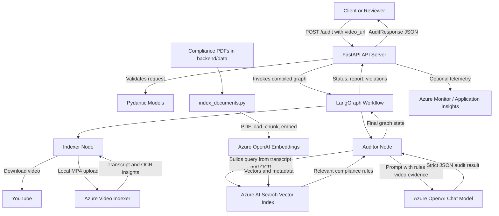
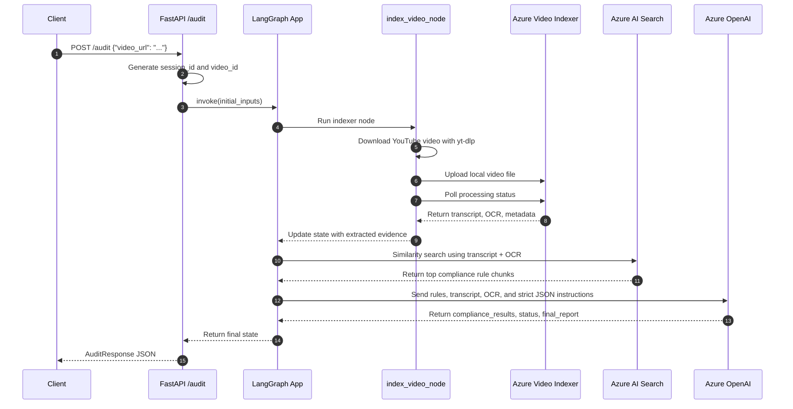

# Brand Guardian AI: Compliance QA Pipeline

Brand Guardian AI is an AI-powered video compliance auditing pipeline that reviews YouTube content against regulatory and platform policy documents. It combines video ingestion, Azure Video Indexer transcription/OCR, Retrieval-Augmented Generation (RAG), and a LangGraph orchestration layer to produce structured pass/fail compliance reports.

The project is designed as a practical compliance automation system for marketing, creator, brand safety, and advertising review workflows. Instead of manually reviewing every video against lengthy policy PDFs, teams can submit a video URL and receive a structured audit containing violations, severity, category, and a final natural-language report.

## Project Overview & Value Proposition

Manual review of influencer videos, advertisements, and branded content is slow, inconsistent, and difficult to scale. This project demonstrates how an AI compliance pipeline can automate the first-pass review process by extracting video evidence, retrieving relevant rules, and applying an LLM-based auditor with a strict JSON output contract.

Core value delivered:

- Reduces review time for video content by automating transcript and OCR analysis.
- Centralizes compliance logic around official policy and regulatory documents.
- Produces recruiter-friendly, API-ready structured output for downstream systems.
- Demonstrates production-oriented AI engineering patterns: graph orchestration, RAG, typed state, API validation, telemetry, and Azure service integration.

Core technology stack:

- Python 3.13
- FastAPI and Pydantic for API serving and request/response validation
- LangGraph for deterministic workflow orchestration
- LangChain for LLM, embeddings, document loading, and vector search integrations
- Azure OpenAI for chat completion and embeddings
- Azure AI Search for vector retrieval over compliance documents
- Azure Video Indexer for speech-to-text and OCR extraction
- Azure Monitor / OpenTelemetry for observability
- yt-dlp for YouTube video download
- uv for dependency management and reproducible local execution

## Key Features

- YouTube video audit intake through a FastAPI `POST /audit` endpoint.
- Health check endpoint for local testing and deployment readiness.
- LangGraph workflow with explicit `indexer -> auditor` execution stages.
- Video ingestion using `yt-dlp`, followed by upload to Azure Video Indexer.
- Azure Video Indexer polling until video processing is complete.
- Transcript extraction from spoken audio.
- OCR extraction from on-screen text.
- RAG-based retrieval from compliance knowledge base PDFs stored in `backend/data`.
- Azure AI Search vector index population script for regulatory and platform policy documents.
- Azure OpenAI compliance auditor that returns strict JSON output.
- Typed graph state using `TypedDict` and append-only list aggregation for results/errors.
- Structured API response model containing session ID, video ID, status, final report, and violations.
- Azure Monitor telemetry hook for request tracing and application monitoring.
- CLI simulation entry point for running the workflow outside the API server.

## Project Structure

```text
.
|-- README.md                          # Project documentation
|-- pyproject.toml                     # Python metadata and dependencies managed by uv
|-- uv.lock                            # Locked dependency graph for reproducible installs
|-- .python-version                    # Python runtime version: 3.13
|-- .gitignore                         # Excludes virtualenv, .env, caches, build artifacts
|-- main.py                            # CLI simulation entry point for the audit workflow
|-- Project2_Langgraph_Architecture.png # Architecture reference image
|-- azure_functions/
|   `-- function_app.py                # Placeholder for future Azure Functions deployment
`-- backend/
    |-- Dockerfile                     # Placeholder for future container packaging
    |-- data/
    |   |-- 1001a-influencer-guide-508_1.pdf # FTC/influencer compliance source document
    |   `-- youtube-ad-specs.pdf       # YouTube advertising policy/spec source document
    |-- scripts/
    |   `-- index_documents.py         # Loads PDFs, chunks text, embeds, and indexes into Azure AI Search
    `-- src/
        |-- api/
        |   |-- __init__.py
        |   |-- server.py              # FastAPI app, Pydantic models, /audit and /health endpoints
        |   `-- telemetry.py           # Azure Monitor OpenTelemetry setup
        |-- graph/
        |   |-- __init__.py
        |   |-- state.py               # Typed LangGraph state and compliance issue schema
        |   |-- nodes.py               # Indexer and auditor node implementations
        |   `-- workflow.py            # LangGraph DAG construction and compiled graph export
        `-- services/
            |-- __init__.py
            `-- video_indexer.py       # Azure Video Indexer integration and YouTube download service
```

## System Architecture



## Data / Code Flow Diagram



## CI/CD & Deployment Pipeline

There is no active CI/CD workflow checked into the repository at this time. The current implementation is structured for cloud deployment but does not yet include a completed deployment pipeline.

Current deployment-related assets:

- `backend/Dockerfile` exists but is currently empty.
- `azure_functions/function_app.py` exists but is currently empty.
- Azure Monitor telemetry support is implemented in `backend/src/api/telemetry.py`.
- The FastAPI service can be run locally with Uvicorn.
- Azure service integrations are implemented through environment variables and Azure SDK authentication.

Recommended production pipeline:

1. Build a backend container image from the FastAPI app.
2. Run linting and tests in GitHub Actions or Azure DevOps.
3. Push the image to Azure Container Registry.
4. Deploy to Azure Container Apps, Azure App Service, or AKS.
5. Store secrets in Azure Key Vault or managed service configuration.
6. Enable managed identity for Azure Video Indexer, Azure AI Search, and Azure OpenAI access where possible.
7. Stream application telemetry to Application Insights through `APPLICATIONINSIGHTS_CONNECTION_STRING`.

## Getting Started & Installation

### Prerequisites

- Python 3.13
- uv package manager
- Azure subscription with access to:
  - Azure OpenAI
  - Azure AI Search
  - Azure Video Indexer
  - Azure Monitor / Application Insights, optional
- Azure CLI login or another credential supported by `DefaultAzureCredential`

### 1. Clone the repository

```bash
git clone <your-repository-url>
cd ComplainceQAPipeline
```

### 2. Install dependencies

```bash
uv sync
```

### 3. Configure environment variables

Create a `.env` file in the project root. The repository already excludes `.env` through `.gitignore`, so credentials should remain local.

```env
AZURE_OPENAI_ENDPOINT=
AZURE_OPENAI_API_KEY=
AZURE_OPENAI_API_VERSION=
AZURE_OPENAI_CHAT_DEPLOYMENT=
AZURE_OPENAI_EMBEDDING_DEPLOYMENT=text-embedding-3-small

AZURE_SEARCH_ENDPOINT=
AZURE_SEARCH_API_KEY=
AZURE_SEARCH_INDEX_NAME=

AZURE_SUBSCRIPTION_ID=
AZURE_RESOURCE_GROUP=
AZURE_VI_ACCOUNT_ID=
AZURE_VI_LOCATION=
AZURE_VI_NAME=

APPLICATIONINSIGHTS_CONNECTION_STRING=

LANGCHAIN_TRACING_V2=
LANGCHAIN_ENDPOINT=
LANGCHAIN_API_KEY=
LANGCHAIN_PROJECT=
```

Important: `VideoIndexerService` expects `AZURE_RESOURCE_GROUP`. If your local `.env` uses a misspelled key such as `AXURE_RESOURCE_GROUP`, rename it to `AZURE_RESOURCE_GROUP`.

Authenticate with Azure if running locally:

```bash
az login
```

### 4. Build the compliance knowledge base

The RAG auditor expects regulatory and policy documents to be indexed into Azure AI Search before audits are run.

```bash
uv run python backend/scripts/index_documents.py
```

This script:

- Loads PDFs from `backend/data`.
- Splits them into overlapping chunks.
- Generates embeddings with Azure OpenAI.
- Uploads the chunks and vectors into Azure AI Search.

### 5. Run the FastAPI server

```bash
uv run uvicorn backend.src.api.server:app --reload
```

Local URLs:

- API root docs: `http://localhost:8000/docs`
- Health check: `http://localhost:8000/health`
- Audit endpoint: `POST http://localhost:8000/audit`

### 6. Run the CLI simulation

```bash
uv run python main.py
```

The CLI path invokes the same LangGraph workflow as the API, using a hardcoded sample YouTube URL in `main.py`.

## API Endpoints

| Method | Endpoint | Description | Request Body | Response |
|---|---|---|---|---|
| `GET` | `/health` | Confirms the API service is running. | None | `{"status": "healthy", "service": "Brand Guardian AI"}` |
| `POST` | `/audit` | Runs a complete video compliance audit. | `{"video_url": "https://youtu.be/..."}` | `session_id`, `video_id`, `status`, `final_report`, `compliance_results` |

Example audit request:

```bash
curl -X POST "http://localhost:8000/audit" \
  -H "Content-Type: application/json" \
  -d "{\"video_url\":\"https://youtu.be/example\"}"
```

Example response shape:

```json
{
  "session_id": "ce6c43bb-c71a-4f16-a377-8b493502fee2",
  "video_id": "vid_ce6c43bb",
  "status": "FAIL",
  "final_report": "The video contains compliance issues related to unsupported claims.",
  "compliance_results": [
    {
      "category": "Claim Validation",
      "severity": "CRITICAL",
      "description": "The video makes an absolute performance claim without supporting disclosure."
    }
  ]
}
```

## Core Modules

| Module | File | Responsibility |
|---|---|---|
| API Server | `backend/src/api/server.py` | Exposes FastAPI app, validates requests, invokes LangGraph, returns structured audit responses. |
| Telemetry | `backend/src/api/telemetry.py` | Configures Azure Monitor OpenTelemetry when an Application Insights connection string is present. |
| Workflow | `backend/src/graph/workflow.py` | Builds and compiles the LangGraph state machine. |
| State Schema | `backend/src/graph/state.py` | Defines the `VideoAuditState` and `ComplianceIssue` structures shared across nodes. |
| Indexer Node | `backend/src/graph/nodes.py` | Downloads video, uploads it to Azure Video Indexer, waits for processing, extracts transcript/OCR. |
| Auditor Node | `backend/src/graph/nodes.py` | Retrieves compliance rules from Azure AI Search and uses Azure OpenAI to produce JSON audit output. |
| Video Indexer Service | `backend/src/services/video_indexer.py` | Encapsulates Azure Video Indexer authentication, upload, polling, and data extraction logic. |
| Document Indexing | `backend/scripts/index_documents.py` | Converts policy PDFs into searchable vector chunks in Azure AI Search. |
| CLI Runner | `main.py` | Runs a local end-to-end audit simulation without starting the API server. |

## Compliance Knowledge Base

The repository includes two source PDFs under `backend/data`:

- `1001a-influencer-guide-508_1.pdf`
- `youtube-ad-specs.pdf`

These documents are used to seed the Azure AI Search vector index. During an audit, the system combines the video transcript and OCR text into a query, retrieves the most relevant policy chunks, and injects those rules into the auditor prompt.

## Observability

The API initializes telemetry through `setup_telemetry()` before the FastAPI application is created. If `APPLICATIONINSIGHTS_CONNECTION_STRING` is configured, Azure Monitor captures request traces, errors, logs, and dependency signals. If the variable is absent, telemetry is skipped without preventing the app from running.

## Current Limitations

- The Dockerfile and Azure Functions entry point are placeholders and need implementation before container or serverless deployment.
- No automated test suite is currently present in the repository.
- The audit endpoint invokes the graph synchronously; long videos may require an async job queue or background task model in production.
- `temp_audit_video.mp4` is a generated local artifact and should not be committed.
- The auditor depends on the LLM returning parseable JSON. The code strips Markdown code fences, but production systems should add stronger schema validation and retry logic.

## Why This Project Matters

This project showcases applied AI engineering beyond a simple prompt demo. It demonstrates how to connect multimodal evidence extraction, vector retrieval, graph-based orchestration, typed API contracts, and cloud observability into a complete compliance QA workflow. For technical recruiters and hiring managers, it highlights practical experience with production-style LLM systems, Azure AI services, backend API design, and end-to-end automation.
