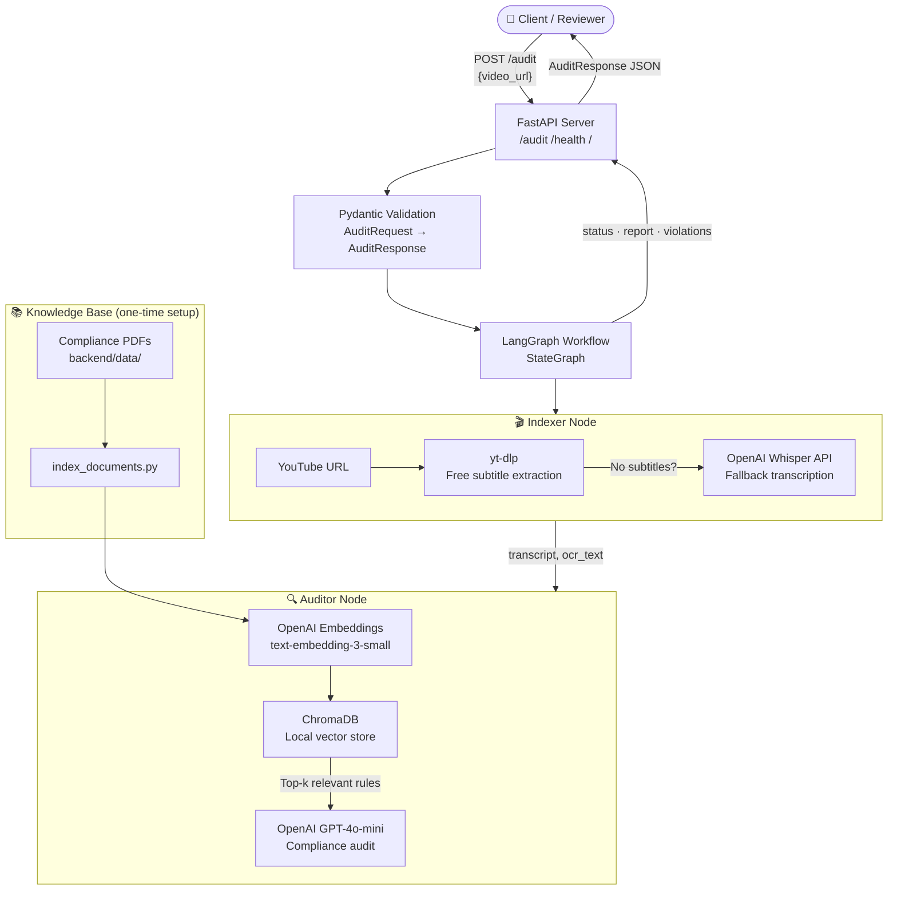
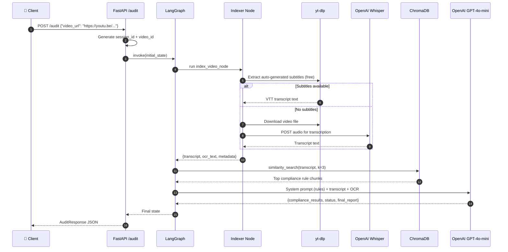

# Brand Guardian AI — Compliance QA Pipeline

> An end-to-end AI pipeline that audits YouTube videos against brand and regulatory compliance rules, produces structured pass/fail reports, and exposes everything through a production-ready FastAPI service.

---

## What This Project Does

Marketing teams, brand safety teams, and compliance officers spend hours manually reviewing influencer videos, sponsored content, and advertisements against lengthy policy documents. **Brand Guardian AI automates that first-pass review**.

Submit a YouTube URL → the system extracts the transcript, retrieves the relevant compliance rules from a knowledge base, and returns a structured JSON audit report flagging every violation with its category, severity, and a plain-English description.

**Built to demonstrate production AI engineering patterns** — not just a prompt demo.

---

## Tech Stack

| Layer | Technology |
|---|---|
| Orchestration | LangGraph (DAG-based stateful workflow) |
| LLM | OpenAI GPT-4o-mini |
| Embeddings | OpenAI text-embedding-3-small |
| Vector Store | ChromaDB (local, persistent, zero-cost) |
| Transcription | yt-dlp subtitle extraction → OpenAI Whisper API fallback |
| API Framework | FastAPI + Pydantic v2 |
| Observability | LangSmith tracing + Python logging |
| Dependency Mgmt | uv (fast, reproducible) |
| Runtime | Python 3.13 |

---

## System Architecture



---

## Data Flow (Sequence Diagram)



---

## Live Example Output

### CLI Run

```
(complainceqapipeline) PS D:\Project_75\ComplainceQAPipeline> uv run python main.py

INFO:brand-guardian-runner:Starting Audit Session: 6be8b194-554b-4273-9efa-49765fa08fe5

--- 1. Input Payload: INITIALIZING WORKFLOW ---
{
  "video_url": "https://youtu.be/dT7S75eYhcQ",
  "video_id": "vid_6be8b194",
  "compliance_results": [],
  "errors": []
}

INFO:brand-guardian:--- [Node: Indexer] Processing: https://youtu.be/dT7S75eYhcQ ---
INFO:video-indexer:Attempting free subtitle extraction from YouTube...
INFO:video-indexer:Subtitles extracted successfully (free).
INFO:brand-guardian:--- [Node: Indexer] Extraction Complete ---
INFO:brand-guardian:--- [Node: Auditor] Querying Knowledge Base & LLM ---
INFO:httpx:HTTP Request: POST https://api.openai.com/v1/embeddings "HTTP/1.1 200 OK"
INFO:httpx:HTTP Request: POST https://api.openai.com/v1/chat/completions "HTTP/1.1 200 OK"

--- 2. WORKFLOW EXECUTION COMPLETE ---

=== COMPLIANCE AUDIT REPORT ===
Video ID:    vid_6be8b194
Status:      FAIL

[ VIOLATIONS DETECTED ]
- [CRITICAL] Claim Validation: The video promotes Neutrogena Ultra Shear sunscreen
  without a clear disclosure of the sponsorship or advertisement, violating the
  requirement for clear language indicating the nature of the content.

[ FINAL SUMMARY ]
The video fails to include a proper disclosure indicating that it is an advertisement
for Neutrogena, which is a critical violation of compliance rules.
```

### API Server Run

```
(complainceqapipeline) PS D:\Project_75\ComplainceQAPipeline> uv run uvicorn backend.src.api.server:app --reload

INFO:     Uvicorn running on http://127.0.0.1:8000 (Press CTRL+C to quit)
INFO:     Started reloader process [10608] using WatchFiles
INFO:     Application startup complete.
INFO:     127.0.0.1:59875 - "GET / HTTP/1.1" 200 OK
INFO:     127.0.0.1:59875 - "GET /docs HTTP/1.1" 200 OK
```

**Home page response (`GET /`):**
```json
{
  "name": "Brand Guardian AI",
  "version": "1.0.0",
  "description": "AI-powered video compliance auditing pipeline",
  "stack": "LangGraph · OpenAI · ChromaDB · FastAPI",
  "endpoints": {
    "docs":   "GET  /docs",
    "health": "GET  /health",
    "audit":  "POST /audit"
  }
}
```

---

## Project Structure

```
ComplainceQAPipeline/
├── main.py                          # CLI entry point — runs audit without starting the server
├── pyproject.toml                   # Dependencies managed by uv
├── uv.lock                          # Locked dependency graph for reproducible installs
├── .python-version                  # Python 3.13
├── .env                             # Local secrets (gitignored)
│
├── backend/
│   ├── data/
│   │   ├── chroma_db/               # ChromaDB local vector store (gitignored, auto-created)
│   │   ├── 1001a-influencer-guide-508_1.pdf   # FTC influencer compliance source
│   │   └── youtube-ad-specs.pdf     # YouTube advertising policy source
│   │
│   ├── scripts/
│   │   └── index_documents.py       # One-time setup: loads PDFs → embeds → stores in ChromaDB
│   │
│   └── src/
│       ├── api/
│       │   ├── server.py            # FastAPI app: /, /health, POST /audit endpoints
│       │   └── telemetry.py         # Logging setup
│       ├── graph/
│       │   ├── state.py             # VideoAuditState TypedDict + ComplianceIssue schema
│       │   ├── nodes.py             # Indexer node (transcript) + Auditor node (RAG + LLM)
│       │   └── workflow.py          # LangGraph DAG: indexer → auditor → END
│       └── services/
│           └── video_indexer.py     # YouTube subtitle extraction + Whisper API fallback
```

---

## Getting Started

### Prerequisites

- Python 3.13
- [uv](https://docs.astral.sh/uv/) package manager
- An **OpenAI API key** (only external paid service required)

No Azure account. No cloud subscriptions. No service deployments.

### 1. Clone & install

```bash
git clone <your-repository-url>
cd ComplainceQAPipeline
uv sync
```

### 2. Configure environment variables

Create a `.env` file in the project root:

```env
# Required
OPENAI_API_KEY=sk-proj-...
OPENAI_CHAT_MODEL=gpt-4o-mini
OPENAI_EMBEDDING_MODEL=text-embedding-3-small

# ChromaDB (local — no setup needed)
CHROMA_PERSIST_DIR=./backend/data/chroma_db
CHROMA_COLLECTION_NAME=brand-compliance-rules

# Optional: LangSmith tracing
LANGCHAIN_TRACING_V2=true
LANGCHAIN_ENDPOINT=https://api.smith.langchain.com
LANGCHAIN_API_KEY=lsv2_pt_...
LANGCHAIN_PROJECT=brand-guardian-prod
```

### 3. Index the compliance knowledge base (one-time)

```bash
uv run python -m backend.scripts.index_documents
```

This reads all PDFs in `backend/data/`, splits them into chunks, embeds them with OpenAI, and stores them in a local ChromaDB collection. Run again whenever you add new policy documents.

### 4. Run the API server

```bash
uv run uvicorn backend.src.api.server:app --reload
```

| URL | Description |
|---|---|
| `http://localhost:8000/` | Home — API info and available endpoints |
| `http://localhost:8000/docs` | Interactive Swagger UI |
| `http://localhost:8000/health` | Health check |
| `POST http://localhost:8000/audit` | Run a compliance audit |

### 5. Run the CLI simulation

```bash
uv run python main.py
```

Runs the full workflow end-to-end in the terminal without starting the server. Uses the hardcoded sample YouTube URL in `main.py`.

---

## API Reference

### `POST /audit`

**Request:**
```json
{ "video_url": "https://youtu.be/dT7S75eYhcQ" }
```

**Response:**
```json
{
  "session_id": "6be8b194-554b-4273-9efa-49765fa08fe5",
  "video_id": "vid_6be8b194",
  "status": "FAIL",
  "final_report": "The video fails to include a proper disclosure indicating that it is an advertisement for Neutrogena, which is a critical violation of compliance rules.",
  "compliance_results": [
    {
      "category": "Claim Validation",
      "severity": "CRITICAL",
      "description": "The video promotes Neutrogena Ultra Shear sunscreen without a clear disclosure of the sponsorship or advertisement."
    }
  ]
}
```

**cURL:**
```bash
curl -X POST "http://localhost:8000/audit" \
  -H "Content-Type: application/json" \
  -d '{"video_url": "https://youtu.be/dT7S75eYhcQ"}'
```

### `GET /health`

```json
{ "status": "healthy", "service": "Brand Guardian AI" }
```

---

## Core Module Summary

| Module | File | What It Does |
|---|---|---|
| **API Server** | `backend/src/api/server.py` | FastAPI app, Pydantic validation, route handlers |
| **Workflow** | `backend/src/graph/workflow.py` | Compiles the LangGraph DAG |
| **State Schema** | `backend/src/graph/state.py` | Typed shared state across all graph nodes |
| **Indexer Node** | `backend/src/graph/nodes.py` | Extracts transcript via subtitles or Whisper API |
| **Auditor Node** | `backend/src/graph/nodes.py` | RAG retrieval + LLM audit → structured JSON |
| **Video Service** | `backend/src/services/video_indexer.py` | yt-dlp subtitle extraction + Whisper fallback |
| **Indexing Script** | `backend/scripts/index_documents.py` | PDF → chunks → embeddings → ChromaDB |
| **CLI Runner** | `main.py` | End-to-end test without starting the server |

---

## AI Engineering Patterns Demonstrated

This project goes beyond a simple chatbot or API wrapper. It demonstrates:

- **Graph-based orchestration** with LangGraph — deterministic, inspectable, and easy to extend with new nodes (e.g., a scoring node, a human-review node)
- **RAG (Retrieval-Augmented Generation)** — the LLM never hallucinates rules because all rules come from real indexed documents
- **Typed state management** — `TypedDict` + `Annotated[List, operator.add]` for safe multi-node state mutation
- **Structured LLM output** — strict JSON contract enforced in the system prompt with post-processing fallback
- **Cost-aware design** — free YouTube subtitle extraction is tried first; paid Whisper API is only called when necessary
- **Separation of concerns** — video service, graph nodes, API, and indexing are independently testable units
- **API-first design** — Pydantic v2 models for both request validation and response serialization

---

## Known Limitations

- The audit endpoint is synchronous; long videos may time out in production (fix: async job queue with a status-polling endpoint)
- OCR from video frames is not currently implemented (subtitle + Whisper covers spoken content; on-screen text requires frame extraction)
- No automated test suite yet
- The Dockerfile is a placeholder — container packaging is the next deployment step

---

## Why This Project

Compliance review is a real, underserved workflow in marketing, fintech, healthcare, and creator economy platforms. This project shows how to build something genuinely useful with modern AI tooling — combining orchestration, retrieval, structured output, and API design into a pipeline that a real team could adopt and extend.
